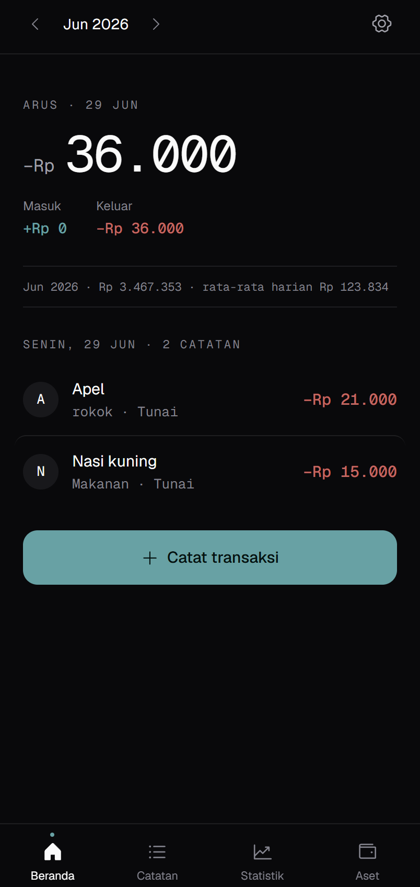
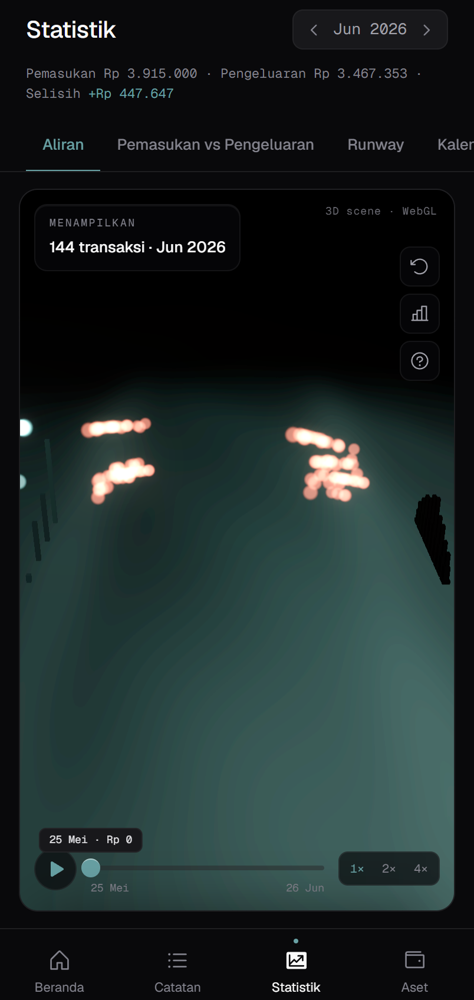
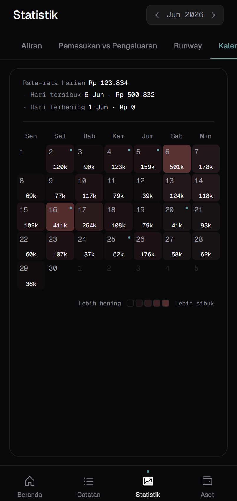
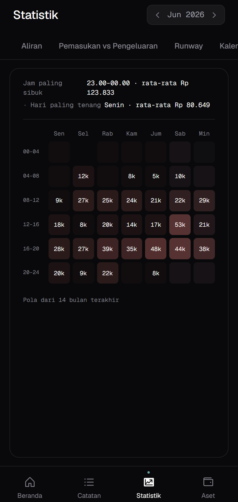
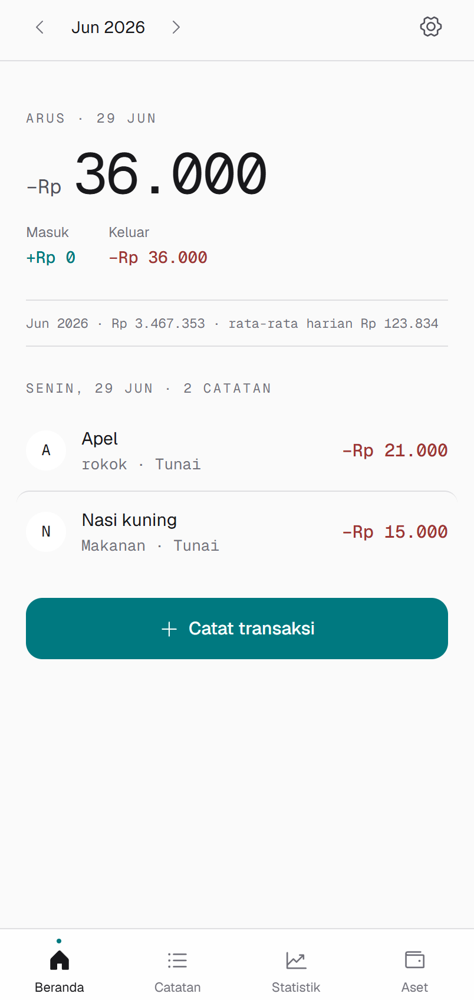
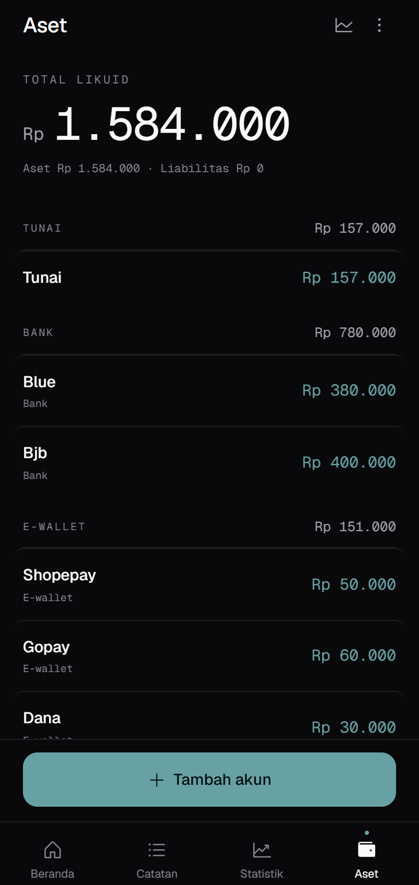

# Kanal

**Pencatat keuangan pribadi yang tenang.** A quiet, anti-gamified personal
finance tracker built as a personal daily-use tool and portfolio piece.



## Design philosophy

Kanal treats money as narrative, not score. There are no streaks, no badges, no
celebratory animations. Just data, presented clearly, judgment withheld. The
signature 3D visualization — *Aliran* (cash flow river) — shows income sources
on the left, expense categories on the right, and the flow between them, month
by month.

Aesthetic direction: frost, slow, contemplative. Reference points include
Linear's calm density, Things 3's quiet precision, Arc browser's editorial
restraint. Geist + Geist Mono, a Zinc base, and a single Glacial Teal accent —
in both dark (primary) and light.

## Features

- **Beranda** — today's balance and recent transactions
- **Catatan** — full transaction list with filters and search
- **Catat Transaksi** — bottom-sheet quick entry with a custom numeric keypad
- **Statistik** — six views for insight:
  - **Aliran** — 3D cash flow river (React Three Fiber)
  - **Pemasukan vs Pengeluaran** — cumulative and daily comparison
  - **Runway** — how long liquid assets last at the current spending rate
  - **Kalender** — daily spending heatmap
  - **Suasana** — hour-of-day × day-of-week spending pattern
  - **Tinjauan** — weekly review with rotating reflective questions
- **Aset** — grouped account view (Tunai, Bank, E-wallet, Tabungan, Kartu
  prabayar, Kartu)
- **PWA** — installable on mobile, works offline
- **Light + dark mode**
- **Local-first** — data lives in IndexedDB via Dexie, never leaves your device
- **Realbyte import** — CSV / XLSX import for migration from Realbyte's
  "Pengelola Keuangan"

## Stack

- Vite + React 18 + TypeScript
- Tailwind CSS v3 (theming via CSS custom properties + `data-theme`)
- React Three Fiber + drei + three.js
- Framer Motion
- Recharts (line / bar view)
- D3-Sankey (2D flow fallback)
- Zustand (state)
- Dexie.js (IndexedDB persistence)
- vite-plugin-pwa (installable, offline)

## Screenshots

Dark mode:





Light mode:




## Local development

```bash
npm install
npm run dev
```

Open http://localhost:5173

## Build

```bash
npm run build
npm run preview
```

## Deploy

See [DEPLOY.md](./DEPLOY.md).

## License

MIT — see [LICENSE](./LICENSE).

## About

Built by [Deezai](https://github.com/IhsanfauzanR). Part of the ZDIS personal
software ecosystem.
